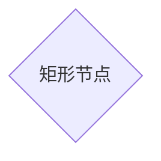
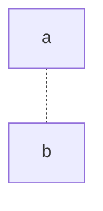
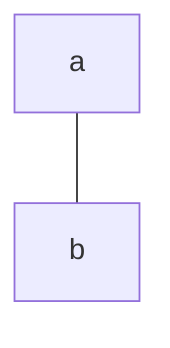
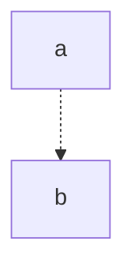
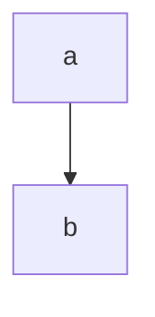
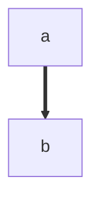

# mermaid流程图使用案例

## 布局流向

- graph TD 从上到下
- graph TD 从顶到底
- graph BT 从底到顶
- graph LR 从左到右
- graph RL 从右到左


## 节点形状详细说明

mermaid插件流程图DSL支持定义如下类型的节点形状：

(1)语法定义**nodeID**：为缺省节点，该nodeID既是节点标识，也是节点文本内容


(2)语法定义**nodeID[nodeText]**：为矩形节点，表示过程


(3)语法定义**nodeID(nodeText)**：为圆角矩形节点，一般用于开始、结束


(4)语法定义**nodeID{nodeText}**：为菱形节点，表示决策判断




(5)语法定义**nodeID>nodeText]**：为非对称形状节点


(6)语法定义**nodeID[/nodeText/]**：为平行四边形1节点


(7)语法定义**nodeID[odeText]**：为平行四边形2节点


(8)语法定义**nodeID[/nodeText\\]**：为梯形1节点


(9)语法定义**nodeID[\nodeText/]**：为梯形2节点


(10)语法定义**nodeID((nodeText))**：为圆形节点


(11)语法定义**nodeID[[nodeText]]**：为子例程节点


(12)语法定义**nodeID([nodeText])**：为体育场状节点


(13)语法定义**nodeID{{nodeText}}**：为六角形节点


(14)语法定义**nodeID[(nodeText)]**：为圆柱状节点


## 连线符号共以下6种类型：

(1)无箭头细虚线：**-.-**




(2)无箭头细实线：**---**




(3)无箭头粗实线：**===**


(4)有箭头细虚线：**-.->**




(5)有箭头细实线：**-–>**




(6)有箭头粗实线：**==>**




## 定义节点连线示例

```
graph LR
nodeA --标注1--> nodeB --标注2--> node3
nodeA1 --> nodeB1 & nodeC1 --> nodeD1
```

结果

```mermaid
graph LR
nodeA --标注1--> nodeB --标注2--> node3
nodeA1 --> nodeB1 & nodeC1 --> nodeD1
```

## 定义子图

```shell
graph LR
subgraph sg1[01]
nodeA3 & nodeA4 --> nodeB3 & nodeB4
end

subgraph sg2[02]
	subgraph inner[0201]
	nodeC2 --> nodeD2
	end
	subgraph inner[0202]
	nodeC1 --> nodeD1
	end
	nodeA2 --> nodeC1
	nodeA2 --> nodeC2
end
subgraph sg3[03]
nodeA1 --> nodeB1
end
nodeA --> nodeA1
nodeA --> nodeA2
nodeA --> nodeA3
nodeA2 --> nodeB3
```

结果

```mermaid
graph LR
subgraph sg1[01]
nodeA3 & nodeA4 --> nodeB3 & nodeB4
end

subgraph sg2[02]
	subgraph inner[0201]
	nodeC2 --> nodeD2
	end
	subgraph inner[0202]
	nodeC1 --> nodeD1
	end
	nodeA2 --> nodeC1
	nodeA2 --> nodeC2
end
subgraph sg3[03]
nodeA1 --> nodeB1
end
nodeA --> nodeA1
nodeA --> nodeA2
nodeA --> nodeA3
nodeA2 --> nodeB3
```

